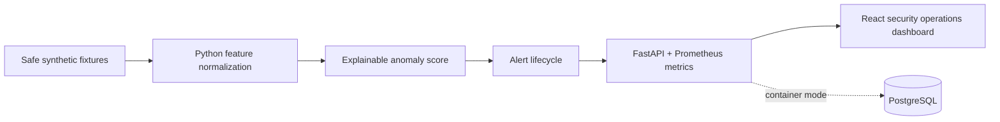

# AegisNet — Network Intrusion Detection & Security Dashboard

**A safe, explainable network-security operations lab built for cybersecurity and backend interviews.** AegisNet turns authorized metadata fixtures into transparent anomaly scores, analyst-controlled alerts, and an investigation-ready dashboard. It intentionally excludes live capture, scanning, traffic generation, packet injection, and external-target interaction.

   

## Why it stands out

| Capability | Interview signal |
|---|---|
| Explainable weighted anomaly model | Demonstrates feature engineering, scoring, and analyst-focused reasoning rather than a black-box alert. |
| Safe Scapy fixture boundary | Shows packet normalization awareness while preserving legal and operational safety. |
| FastAPI + PostgreSQL-ready repository | Demonstrates API design, dependency boundaries, observability metrics, and switchable local/container storage. |
| React security operations dashboard | Demonstrates secure UX, evidence presentation, responsive design, and explicit alert lifecycle controls. |
| Compose + Kubernetes + CI | Demonstrates deployment literacy and repeatable quality gates. |

## Safe operating model

> The application evaluates fixed synthetic metadata by default. Its Scapy adapter is limited to explicitly authorized local fixture PCAP files and is not exposed through the HTTP API. It cannot sniff, scan, emit, or intercept network traffic.

NIST’s guidance includes network-based and network-behavior-analysis systems as IDPS technology classes; AegisNet is a constrained educational implementation of the visibility and triage portion of that workflow.[1]

The demo uses IETF documentation networks (`192.0.2.0/24`, `198.51.100.0/24`, and `203.0.113.0/24`) that RFC 5737 reserves for examples.[2]

## Architecture



Read [Architecture](docs/ARCHITECTURE.md), [Security Boundaries](docs/SECURITY.md), and the [Demo Runbook](docs/DEMO.md) for details.

## Quick start — no containers

```bash
pip install -e '.[dev]'
make api
```

In another terminal:

```bash
cd apps/web
npx --yes pnpm@10.6.3 install
npx --yes pnpm@10.6.3 dev
```

Open `http://localhost:5183`, select **Run safe demo**, review the evidence, and change alert status through the human-controlled workflow.

## Full local lab

```bash
docker compose up --build
```

The Compose stack serves the dashboard on `http://localhost:8083`, the API on `http://localhost:4500`, and PostgreSQL as a private service. Kubernetes intent is available in [`k8s/aegisnet.yaml`](k8s/aegisnet.yaml); it references a deployment-provided database secret instead of embedding a credential.

## Quality checks

```bash
ruff check .
pytest -q
cd apps/web && npx --yes pnpm@10.6.3 lint && npx --yes pnpm@10.6.3 test && npx --yes pnpm@10.6.3 build
```

## References

[1] [NIST SP 800-94: Guide to Intrusion Detection and Prevention Systems](https://csrc.nist.gov/pubs/sp/800/94/final)

[2] [RFC 5737: IPv4 Address Blocks Reserved for Documentation](https://datatracker.ietf.org/doc/html/rfc5737)
