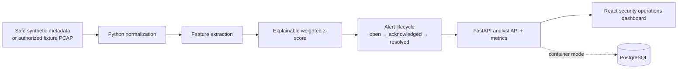

# AegisNet Architecture

AegisNet is a **defensive, metadata-oriented portfolio lab**. It models a network-based detection workflow without opening a live interface, sending packets, scanning a network, or accepting arbitrary file paths through the analyst API. NIST describes network-based and network-behavior-analysis systems among the major classes of intrusion-detection and prevention technologies; the project uses that model for an explainable, bounded demonstration rather than production threat prevention.[1]

| Boundary | Deterministic local mode | Container mode |
|---|---|---|
| Evidence store | In-memory repository | PostgreSQL-backed alert persistence |
| Event source | Fixed synthetic metadata scenarios | Same safe scenarios; optional authorized fixture-PCAP adapter |
| Model | Transparent weighted z-score baseline | Same model, retaining explainability |
| Dashboard | Vite proxy to FastAPI | Nginx same-origin proxy to API |

The synthetic scenarios are deliberately illustrative: a normal web session, a port-spread signal, repeated authentication failures, and a high-entropy DNS/outbound-volume signal. They are **not claims that any single feature proves an intrusion**. Analysts inspect the explanation set and control the lifecycle state.

The documentation uses `192.0.2.0/24`, `198.51.100.0/24`, and `203.0.113.0/24`, address blocks reserved for documentation by RFC 5737.[2]

## References

[1] [NIST SP 800-94: Guide to Intrusion Detection and Prevention Systems](https://csrc.nist.gov/pubs/sp/800/94/final)

[2] [RFC 5737: IPv4 Address Blocks Reserved for Documentation](https://datatracker.ietf.org/doc/html/rfc5737)
